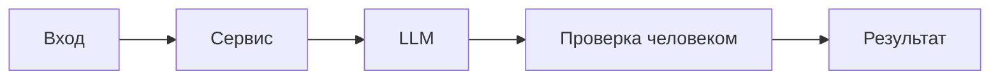

# ADR: решение для первого рабочего сценария

- Статус: proposed / accepted
- Дата: неизвестно (учебный сценарий)
- Ответственные: неизвестно

## Контекст

В учебном сценарии добавлен endpoint POST `/api/reviews`, который передаёт `diff` в `ReviewService.review`. Требования CASE: `SEC-1` (очистка секретов), `API-1` (лимит 20 000 символов и 413), `REL-1` (timeout 10 c и контролируемая ошибка), `OUT-1` (структура ответа), `SCOPE-1`, `QA-1`, `OBS-1`.
## Решение

Минимальные изменения без смены контракта API: добавить проверку размера diff на входе и возврат 413; перед вызовом LLM выполнять локальную очистку чувствительных данных; оборачивать вызов LLM таймаутом 10 c и маппингом ошибок на контролируемые ответы. Ответ сервиса может остаться текущим, если внешние потребители не требуют `OUT-1`.
## Рассмотренные альтернативы

| Альтернатива | Почему не выбрали сейчас |
|---|---|
| Сразу перейти на строгий `OUT-1` | Может нарушить обратную совместимость; без явных потребителей оставить как предложение |
| Делегировать очистку секретов клиенту LLM | Риск утечки при смене клиента/ошибках; локальная очистка снижает риск |
| Откладывать лимит размера на уровень шлюза | Не всегда под контролем команды; локальная проверка обеспечивает соблюдение правила |

## Последствия и главный риск

- Положительные последствия:
  - Предсказуемое поведение API при больших диффах и ошибках LLM
  - Снижение вероятности утечки секретов
  - Улучшение эксплуатационных метрик
- Ограничения:
  - Возможные ложные срабатывания фильтрации
  - Отказ при больших диффах потребует изменений у клиентов
- Главный риск:
  - Очистка может удалить важный для анализа контекст; балансируем масками и журналируем только статус (OBS-1)
- Как проверим риск:
  - Интеграционные тесты с искусственными секретами и нагрузочные проверки на пороге размера

## Архитектурная схема

## Как использовали AI

- Для чего: сформировать ADR для первого инкремента с указанием правил CASE и компромиссов.
- Тип промпта: master prompt
- Строка в [`prompts.md`](prompts.md): [P1-02](prompts.md#p1-02)
- Что проверили и исправили сами: Самопроверка AI — согласованность с analysis.md и product_management.md; отсутствие изменений в защищённых разделах.
