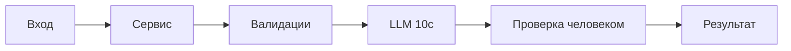

# ADR: решение для первого рабочего сценария

- Статус: proposed
- Дата: 2026-09-16
- Ответственные: учебная команда, агент OpenCode

## Контекст

По diff видно базовый сервис ревью: API вызывает ReviewService, который отправляет сырый diff во внешний LLM и возвращает {"comment": ...}. Правила требуют: очистка секретов (SEC-1), ограничение размера (API-1), тайм-аут и контролируемые ошибки (REL-1), формат ответа OUT-1, логирование по OBS-1.

## Решение

Добавить слой валидации и нормализации: санитайзер секретов, проверка длины diff (отклонять >20000 с 413), обёртка клиента LLM с тайм-аутом 10с и переводом ошибок в контролируемые ответы, маппер ответа в формат OUT-1. Логировать только request_id, длительность, статус.

## Рассмотренные альтернативы

| Альтернатива | Почему не выбрали сейчас |
|---|---|
| Отправлять diff как есть | Нарушает SEC-1 и повышает риск утечки |
| Разбивать diff на чанки и параллелить | Усложняет первую итерацию; требования к нагрузке неизвестны |
| Сохранять результаты ревью в базе | Выходит за рамки сценария; политика хранения неизвестна |

## Последствия и главный риск

- Положительные последствия:
  - Соответствие правилам SEC-1, API-1, REL-1, OUT-1, OBS-1.
- Ограничения:
  - Потенциальная потеря деталей при нормализации ответа; ограничение в 3 риска.
- Главный риск:
  - Ложное чувство безопасности при неполной очистке секретов.
- Как проверим риск:
  - Unit-тест санитайзера на наборе паттернов секретов; интеграционные тесты с перехватом prompt.

## Архитектурная схема

## Как использовали AI

- Для чего: оформить решение и последствия на основе правил и diff.
- Тип промпта: master prompt.
- Строка в [`prompts.md`](prompts.md): P1-02.
- Что проверили и исправили сами: согласованность с проектными документами; отсутствие изменения защищённых разделов. Проверка человеком ожидается.
