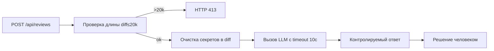

# Анализ процесса: AS IS и TO BE

## AS IS

Пользователь отправляет POST `/api/reviews` с полем `diff`. FastAPI-обработчик принимает dict и обращается к `payload["diff"]`, затем вызывает `review_service.review`. Сервис формирует строковый prompt, вставляя diff как есть, вызывает `llm.generate` и возвращает `{"comment": answer}`. Решение по PR принимает человек. Риски: нет видимой локальной фильтрации секретов (SEC-1), нет ограничения размера (API-1), не показаны таймаут и обработка ошибок (REL-1). Неизвестно: глобальные middleware, клиент LLM.

## TO BE

Процесс с минимальными изменениями: перед вызовом LLM применяется локальная очистка секретов; длина diff проверяется и при превышении 20 000 символов возвращается 413; вызов LLM обёрнут таймаутом 10 c и контролируемой обработкой ошибок. Ответ сервиса остаётся совместимым, но внутренняя обработка надёжнее.

## Разница

| Что меняется | AS IS | TO BE | Как проверим изменение |
|---|---|---|---|
| Ограничение размера | Нет в видимом коде | Возврат 413 при >20k | См. tests_integration.md и tests_e2e.md |
| Очистка секретов | Не видно | Локальная очистка до LLM | См. tests_unit.md и tests_integration.md |
| Таймаут и обработка | Не видно | Таймаут 10 c и контролируемый ответ | См. tests_integration.md |

## Как использовали AI

- Для чего: описать AS IS и предложить минимальные изменения TO BE по правилам CASE.
- Тип промпта: master prompt
- Строка в [`prompts.md`](prompts.md): [P1-02](prompts.md#p1-02)
- Что проверили и исправили сами: Самопроверка AI — диаграмма рендерится, формулировки согласованы с `problem.md` и `adr.md`.
