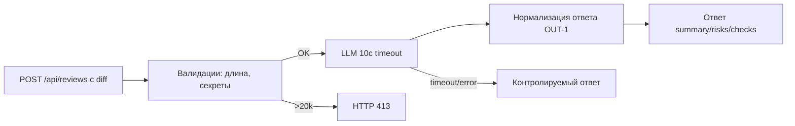

# Анализ процесса: AS IS и TO BE

## AS IS

Разработчик отправляет HTTP POST на эндпоинт (по diff видно: POST /api/reviews) с полем diff. FastAPI-хендлер принимает payload: dict и пересылает payload["diff"] в ReviewService.review(). ReviewService составляет prompt c сырым diff и вызывает llm.generate(). Ответ модели заворачивается в {"comment": answer} и возвращается клиенту. Не показаны: очистка секретов, проверка размера diff, тайм-аут и контроль ошибок LLM, форматирование ответа под контракт OUT-1. Человек-ревьюер затем использует ответ как подсказку. Неизвестно: логирование и мониторинг.

## TO BE

Добавить валидации и адаптацию ответа по контракту. Перед вызовом LLM выполняется очистка секретов (SEC-1) и проверка длины diff (API-1). Вызов LLM ограничен тайм-аутом 10с, ошибки переводятся в контролируемый ответ (REL-1). Ответ нормализуется к формату OUT-1: summary, до 3 risks, checks. Логи содержат только request_id, длительность, статус (OBS-1). Сервис даёт рекомендации и не выполняет действие в VCS (SCOPE-1).

## Разница

| Что меняется | AS IS | TO BE | Как проверим изменение |
|---|---|---|---|
| Очистка секретов | Не показана | Санитайзер до вызова LLM (SEC-1) | Unit-тест с токеном в diff и перехватом prompt |
| Ограничение размера | Не показано | 413 при >20k (API-1) | Интеграционный тест с 20001 символом |
| Тайм-аут LLM | Не показан | 10с и контролируемый ответ (REL-1) | Интеграционный тест с искусственной задержкой |
| Формат ответа | {comment: ...} | summary/risks/checks (OUT-1) | Контрактный тест API |

## Как использовали AI

- Для чего: описать AS IS/TO BE с опорой на diff и правила.
- Тип промпта: master prompt.
- Строка в [`prompts.md`](prompts.md): P1-02.
- Что проверили и исправили сами: согласованность диаграммы и таблицы разницы; ссылки на правила. Проверка человеком ожидается.
