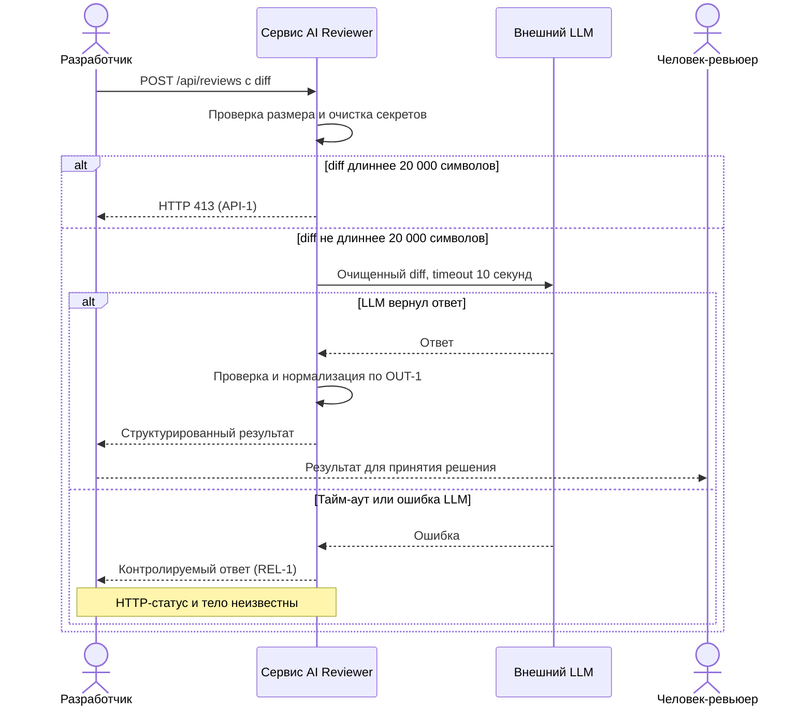

# Use cases и user stories

## Первый рабочий сценарий

Роли и поток:

- Разработчик — отправляет diff PR в API.
- Сервис AI Reviewer — валидирует размер по API-1, удаляет секреты по SEC-1, формирует ограниченный prompt, вызывает внешний LLM с тайм-аутом 10 секунд по REL-1, нормализует ответ по OUT-1.
- Человек-ревьюер — использует структурированный результат для принятия решения по PR.

Сценарий: разработчик отправляет diff PR в API; сервис проверяет размер (20000 символов допустимо, 20001 и более — отклоняется с HTTP 413 по API-1), удаляет секреты (SEC-1), вызывает внешний LLM с тайм-аутом 10 секунд (REL-1), нормализует ответ до контракта OUT-1 и отдаёт результат. Используемый HTTP-статус успешного ответа не определён Context Pack и рассматривается как проектное предложение.

Не входит в этот сценарий:

- Аутентификация и интеграции с внешними VCS; любые автоматические действия в репозитории (SCOPE-1).

## Use case

| Поле | Значение |
|---|---|
| Акторы | Разработчик (вызывает API); Человек-ревьюер (использует результат) |
| Триггер | POST /api/reviews с телом {diff} |
| Предусловия | API доступно; сеть доступна; наличие секретов в diff возможно, сервис обязан удалить их перед вызовом внешнего LLM (SEC-1) |
| Основной результат | JSON по OUT-1: summary; risks (0–3 элемента с полями file, line, evidence, risk); checks[] |
| Ошибка или отказ | HTTP 413 при diff длиной 20001+ символов (API-1); при тайм-ауте внешнего LLM возвращается контролируемый ответ (REL-1), точный статус/тело — неизвестно (Context Pack) |



## User stories и acceptance criteria

```gherkin
Feature: Получение структурированного ревью диффа

  Scenario: Позитивный ответ в контракте OUT-1 при ровно 20000 символов
    Given diff длиной ровно 20000 символов
    When я отправляю POST /api/reviews с телом {"diff": "..."}
    Then я получаю успешный ответ (статус не определён Context Pack; проектное предложение: 200 OK)
    And тело соответствует контракту OUT-1: summary; risks (0–3 с file, line, evidence, risk); checks[]

  Scenario: Отклонение слишком большого diff
    Given diff длиной 20001 символ
    When я отправляю POST /api/reviews
    Then я получаю 413 (API-1)
    # Тело ответа неизвестно (Context Pack)

  Scenario: Ответ содержит не более трёх рисков с требуемыми полями
    Given успешный ответ сервиса
    Then массив risks содержит от 0 до 3 элементов
    And каждый элемент имеет поля file, line, evidence и risk (OUT-1)

  Scenario: Контролируемый тайм-аут LLM
    Given внешний LLM отвечает дольше 10 секунд
    When сервис запрашивает ревью
    Then я получаю контролируемый ответ согласно REL-1
    # Неизвестно: точный HTTP-статус и формат тела при тайм-ауте (Context Pack)
```

### User stories

- Как разработчик, я хочу отправить diff до 20000 символов, чтобы получить структурированный результат для передачи ревьюеру и ускорить рассмотрение PR.
- Как человек-ревьюер, я хочу видеть не более трёх проверенных рисков с файлами и строками, чтобы быстро понять важные места в изменениях.

### Acceptance criteria

См. сценарии в разделе выше.

## Как использовали AI

- Для чего: оформить сценарий, use case и критерии приёмки из правил и diff.
- Тип промпта: master prompt.
- Строка в [`prompts.md`](prompts.md): P1-02.
- Что проверили и исправили сами: проверили соответствие OUT-1, API-1, REL-1; отделили предложения от фактов. Проверка человеком ожидается.
