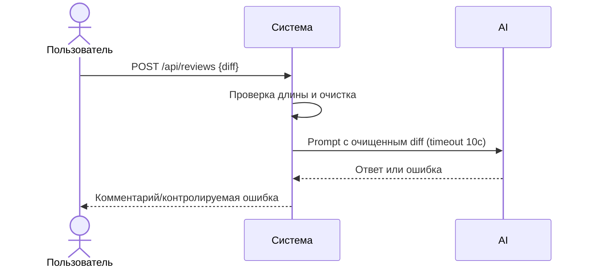

# Use cases и user stories

## Первый рабочий сценарий

**Когда** пользователь отправляет diff в POST `/api/reviews`, **система** проверяет длину, очищает чувствительные данные и запрашивает LLM с таймаутом, **а пользователь получает** контролируемый ответ с рекомендациями без утечки секретов.

Не входит в этот сценарий:

- Аутентификация/авторизация, хранение ревью, интеграция с GitHub.

## Use case

| Поле | Значение |
|---|---|
| Актор | Разработчик/ревьюер |
| Триггер | Появился diff PR, требуется оценка рисков |
| Предусловия | API доступен; diff ≤ 20 000 символов |
| Основной результат | Возвращён контролируемый результат без утечек |
| Ошибка или отказ | 413 при слишком большом diff; контролируемая ошибка при таймауте LLM |



## User stories и acceptance criteria

```gherkin
Feature:

  Scenario: Позитивный
    Given корректный diff длиной ≤ 20000 символов
    When пользователь отправляет POST /api/reviews
    Then система возвращает результат без утечки секретов

  Scenario: Негативный или граничный
    Given diff длиной > 20000 символов
    When пользователь отправляет POST /api/reviews
    Then система возвращает 413 и не вызывает LLM
```

## Как использовали AI

- Для чего: описать сценарий использования и критерии приёмки, связанные с SEC-1, API-1, REL-1.
- Тип промпта: master prompt
- Строка в [`prompts.md`](prompts.md): [P1-02](prompts.md#p1-02)
- Что проверили и исправили сами: Самопроверка AI — согласование с analysis.md; исключены неразрешённые темы.
