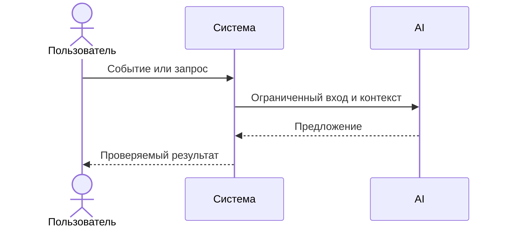

# Use cases и user stories

## Первый рабочий сценарий

**Когда** разработчик отправляет diff PR в API, **система** валидирует размер и очищает секреты, формирует ограниченный prompt и вызывает LLM с тайм-аутом 10с, нормализует ответ по контракту, **а пользователь получает** структурированный результат с summary, до трёх risks и checks.

Не входит в этот сценарий:

- Аутентификация и интеграции с внешними VCS; любые автоматические действия в репозитории (SCOPE-1).

## Use case

| Поле | Значение |
|---|---|
| Актор | Разработчик / Человек-ревьюер |
| Триггер | POST /api/reviews с телом {diff} |
| Предусловия | Дифф не содержит запрещённого содержимого; сеть доступна |
| Основной результат | JSON: summary, risks[≤3{file,line,evidence,risk}], checks[] |
| Ошибка или отказ | 413 при diff>20k; контролируемый ответ при тайм-ауте LLM |



## User stories и acceptance criteria

```gherkin
Feature: Получение структурированного ревью диффа

  Scenario: Позитивный ответ в контракте OUT-1
    Given валидный diff менее 20000 символов
    When я отправляю POST /api/reviews с телом {"diff": "..."}
    Then я получаю 200 OK и JSON с полями summary, risks (до 3 элементов) и checks

  Scenario: Отклонение слишком большого diff
    Given diff длиной 20001 символ
    When я отправляю POST /api/reviews
    Then я получаю 413 и сообщение о превышении лимита по API-1

  Scenario: Контролируемый тайм-аут LLM
    Given внешний LLM отвечает дольше 10 секунд
    When сервис запрашивает ревью
    Then я получаю контролируемый ответ без 500 и с указанием статуса
```

## Как использовали AI

- Для чего: оформить сценарий, use case и критерии приёмки из правил и diff.
- Тип промпта: master prompt.
- Строка в [`prompts.md`](prompts.md): P1-02.
- Что проверили и исправили сами: проверили соответствие OUT-1, API-1, REL-1; отделили предложения от фактов. Проверка человеком ожидается.
