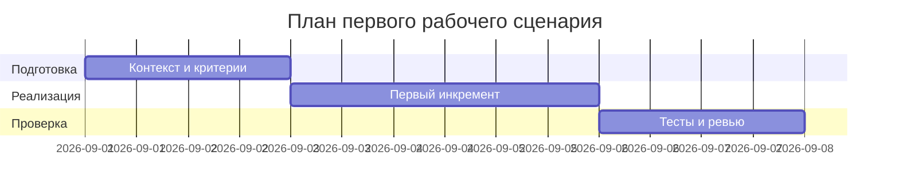

# План поставки

## Инкременты и ответственность

| Инкремент | Наблюдаемый результат | Что делает человек | Что делает AI или субагент | Проверка | Зависимости |
|---|---|---|---|---|---|
| 1 | Санитайзер и проверка размера diff | Определяет паттерны секретов | Реализует и тестирует санитайзер; добавляет 413 логику | Unit и интеграционные тесты | Правила SEC-1, API-1 |
| 2 | Тайм-аут LLM и контролируемые ошибки | Определяет формат контролируемого ответа | Имплементирует тайм-аут 10с и обработку исключений | Интеграционный тест с задержкой | REL-1 |
| 3 | Маппинг ответа в OUT-1 | Уточняет контракт | Преобразует ответ в summary/risks/checks | Контрактный тест API | OUT-1 |

## Диаграмма Ганта

Замените даты и задачи на свой план.

## Как использовали AI

- Для чего: набросать учебный план поставки первого сценария.
- Тип промпта: master prompt.
- Строка в [`prompts.md`](prompts.md): P1-02.
- Что проверили и исправили сами: соответствие зависимостей правилам; проверяемость каждого инкремента. Проверка человеком ожидается.
