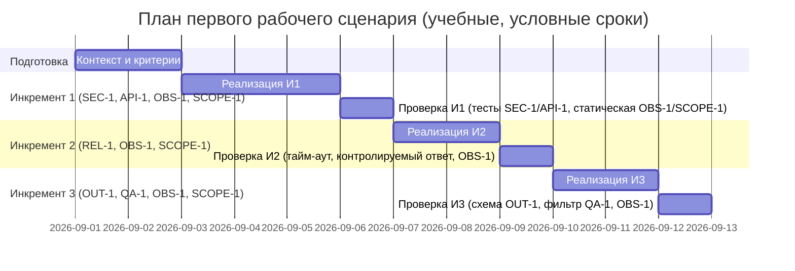

# План поставки

## Инкременты и ответственность

| Инкремент | Наблюдаемый результат | Что делает человек | Что делает AI или субагент | Проверка готовности | Зависимости |
|---|---|---|---|---|---|
| 1 | Для входа ≤20000 символов секреты удаляются/маскируются до вызова LLM (SEC-1); для >20000 возвращается 413 без вызова LLM (API-1). Логи содержат только request_id, длительность и статус (OBS-1). | Формулирует паттерны секретов и допустимые маски; уточняет, что сервис не выполняет действия вне ревью (SCOPE-1, как учебное предложение). | Имплементирует санитайзер (SEC-1) и проверку длины (API-1); обеспечивает логирование без содержимого diff/ответа (OBS-1); не добавляет побочных действий (SCOPE-1). | Unit-тесты санитайзера на кейсах token/password/private key → [REDACTED]; интеграционный тест: 20000 проходит, 20001 даёт 413 без вызова LLM; статическая проверка логов на соответствие OBS-1; обзор кода на отсутствие побочных действий по SCOPE-1. | SEC-1, API-1, OBS-1, SCOPE-1; каркас API |
| 2 | Внешний вызов LLM ограничен 10 сек (REL-1). При тайм-ауте/ошибке возвращается контролируемый ответ по описанному формату; логирование совместимо с OBS-1. | Определяет формат контролируемого ответа и допустимый допуск измерения времени; подтверждает отсутствие побочных действий (SCOPE-1). | Добавляет тайм-аут 10с и обработку ошибок в контролируемый ответ (REL-1); логирует только request_id, длительность и статус (OBS-1). | Интеграционный тест с заглушкой LLM >10с: время внешнего вызова ≤10с+допуск; ответ соответствует формату; логи не содержат тела diff/ответа (OBS-1); статическое подтверждение отсутствия побочных действий (SCOPE-1). | Инкремент 1; REL-1; OBS-1; SCOPE-1 |
| 3 | Ответ API соответствует OUT-1 (summary, risks[≤3], checks); в risks включаются только подтверждённые элементы (QA-1). Логи не содержат содержимого (OBS-1). | Уточняет контракт OUT-1 и критерии подтверждения рисков; готовит примеры валидных/невалидных рисков. | Маппит ответ LLM в OUT-1; фильтрует/валидирует risks по QA-1; схема-валидация OUT-1. | Контрактный тест схемы OUT-1; тесты фильтрации QA-1: неподтверждённые риски не попадают; статический обзор на соблюдение SCOPE-1; проверка журналов на OBS-1. | Инкременты 1–2; OUT-1; QA-1; OBS-1; SCOPE-1 |

## Диаграмма Ганта

## Как использовали AI

- Для чего: набросать учебный план поставки первого сценария.
- Тип промпта: master prompt.
- Строка в [`prompts.md`](prompts.md): P1-02.
- Что проверили и исправили сами: соответствие зависимостей правилам; проверяемость каждого инкремента. Проверка человеком ожидается.
