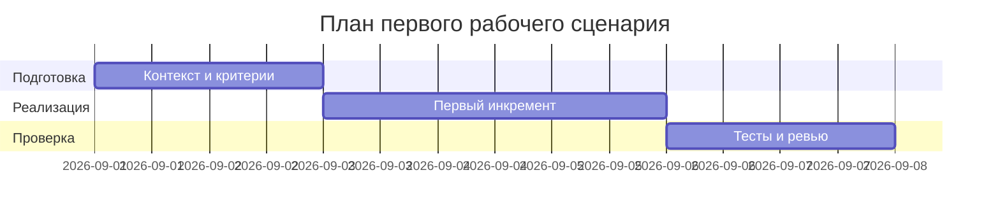

# План поставки

## Инкременты и ответственность

| Инкремент | Наблюдаемый результат | Что делает человек | Что делает AI или субагент | Проверка | Зависимости |
|---|---|---|---|---|---|
| 1 | Добавлен лимит размера и возврат 413 | Утверждает правило и порог | Предлагает проверку и шаблон обработки | tests_integration: >20k -> 413 | CASE API-1 |
| 2 | Очистка секретов перед LLM | Определяет набор масок | Генерирует правила фильтрации и тесты | tests_unit: секрет удалён | CASE SEC-1 |
| 3 | Таймаут и контролируемые ответы | Выбирает стратегию ошибок | Предлагает паттерн обёртки вызова LLM | tests_integration: таймаут ≤10c | CASE REL-1 |

## Диаграмма Ганта

Замените даты и задачи на свой план.

## Как использовали AI

- Для чего: подготовить план инкрементов и проверки, увязанные с правилами CASE.
- Тип промпта: master prompt
- Строка в [`prompts.md`](prompts.md): [P1-02](prompts.md#p1-02)
- Что проверили и исправили сами: Самопроверка AI — таблица согласована с tests_* документами; без вымышленных дат.
